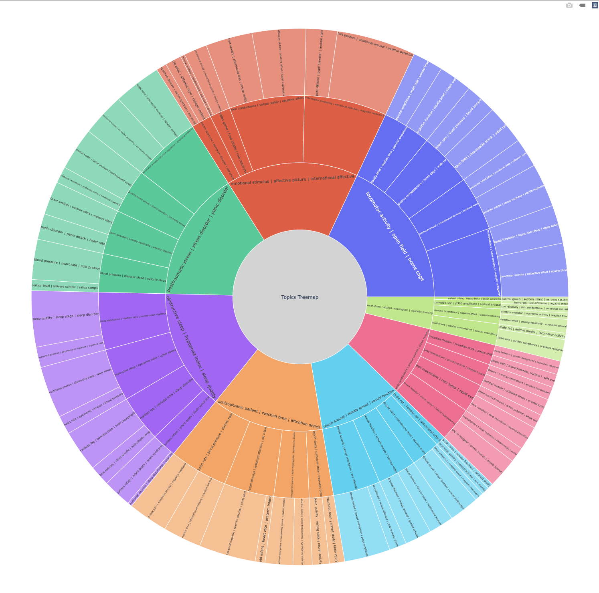

# BUNKAtech

Bunkatech is an aggregation of machine learning modules specialized in the embedding of multi-format information.

The modules carry out semantic tasks using embeddings (terms extraction, document embeddings etc), Network analysis using Graph Embeddings, Search using Semantic Search, Trend Analysis using Moving Averages, Topic Modeling, Nested Topic Modeling, Image Embedding & Front-end display using Streamlit.

This README.md file has been created with the help of the fantastic work of [MaartenGr](https://github.com/MaartenGr) and his package [BERTopic](https://github.com/MaartenGr/BERTopic/blob/master/README.md)

## Installation

First, Create a virtual environement to protect you other environements. Bunka has a lot of packages and a lot of depedencies. Once created, activate it

```bash
python -m venv bunka
source bunka/bin/activate
```

If you wish to deactivate the venv, type the following:

```bash
deactivate
```

Clone the repository

```bash
git clone https://github.com/charlesdedampierre/bunkatech.git
```

Then, install all the necessary packages:

```bash
pip install requirements.txt
```

Load the main semantics model

```bash
python -m spacy download en_core_web_sm
```

In order install the package locally on your marchine, creates the python package using setup.py and install it trought pip in your local package repository.

```bash
python setup.py sdist bdist_wheel
cd dist/
pip install bunkatech-0.0.1.tar.gz
```

## Getting Started with real examples

For an in-depth overview of the features of BUNKAtech you can check the full documentation [here](https://docs.google.com/document/d/1CsJ-dhpm89e42hH7XPNuUtT1nAeCzC1kuIFEja_WyVs/edit) or you can follow along with one of the examples below using the Jupyter-Notebooks scripts contained in the examples/ repository.

## Quick Start with Bunka

```python
from bunkatech import Bunka
from sklearn.datasets import fetch_20newsgroups
import pandas as pd
 
docs = fetch_20newsgroups(subset='all',  remove=('headers', 'footers', 'quotes'))['data']
data = pd.DataFrame(docs, columns = ['docs'])
data = data.sample(2000, random_state = 42)
data['doc_index'] = data.index


bunka = Bunka(data, 
            text_var = 'docs', 
            index_var = 'doc_index', 
            extract_terms=True,
            terms_embedding=False,
            docs_embedding=False)


# Extract the computed objects
terms = bunka.terms
terms_embeddings = bunka.terms_embeddings
docs_embeddings = bunka.docs_embeddings

```

As the class inherits from **BasicSemantics**, it also instantiates itself with a pandas DataFrame and the name of the text_var columns & index_var columns. There is a lighter fitted part.

As the class also inherits from other sublasses, we can call also their methods without recodign everything in the Bunka class.

```python
fig = bunka.origami_projection_unique(
                    left_axis= ['love'],
                    right_axis = ['hate'],
                    height=800,
                    width=1500,
                    type="terms",
                    dispersion=True,
                    barometer=True,
                    explainer = True
    
                )
fig.show()
```



The code above displays the projection of the terms on an axis 'love-hate' following the methodology contained in the following [paper](https://journals.sagepub.com/doi/full/10.1177/0003122419877135).

The methods traditionaly belongs to the class Origami but as Bunka inherited from this class, it can also call it.

```python
fig = bunka.fit_draw(
            variables=["main form"],
            top_n=500,
            global_filter=0.2,
            n_neighbours=6,
            method="node2vec",
            n_cluster=10,
            bin_number=30,
            black_hole_force=3,
            color="community",
            size="size",
            symbol="entity",
            textfont_size=9,
            edge_size=1,
            height=2000,
            width=2000,
            template="plotly_dark",
        )
```

The code above calls a methods of the SemanticNetworks class. it creates a network of extracted terms using the [node2vec algorithm](https://snap.stanford.edu/node2vec/)

## Overview

The terms & embeddings are created when the function is initialized.
For quick access to common functions that use those embeddings, here is an overview of Bunkatech's main methods:

| Method | Code  |
|-----------------------|---|
| Project the Data on a Semantic Axis    |  `.origami_projection_unique(left_axis, right_axis)` |
| Create a Nested Map of the document Embeddings  |  `.nested_maps(map_type="sunburst")` |
| Get the list of 15 clusters described each by 5 terms    |  `.get_clusters(topic_number=15, top_terms = 5)` |
| Visualize the clusters with Plotly | `.visualize_topics_embeddings()`  |
| Get the centroids elements of each cluster     |  `.get_centroid_documents()` |
| Get the evolution of topics in time    |  `.temporal_topics()` |
| Get the Semantic Trend and the specific terms by trend |  `.moving_average_comparison()` |
| Draw a Semantic Network of terms based on co-occurence |  `.fit_draw()` |

## Calling Bunka on the Streamlit Package

Bunka modules can be used using the [Streamlit Package](https://streamlit.io/). All the code is located on the **app.py** script where you can decide of the data to ingest etc.

In order to call the platform locally on your machine.

```bash
streamlit run app.py
```

### Embeddings Models

Different embeddings modelds exist. They word with the Help of [Sentence-bert](https://www.sbert.net/). The better efficiency/time ratio is **all-MiniLM-L6-v2**. But when it comes to multilangual needs, distiluse-base-multilingual-cased-v1 works well.

### Parallel processing

By default the processus of terms extraction, terms embeddings & document embeddings are parralized to increase the speed.

More variables can me modified, they are all indicated in the description of the function.
